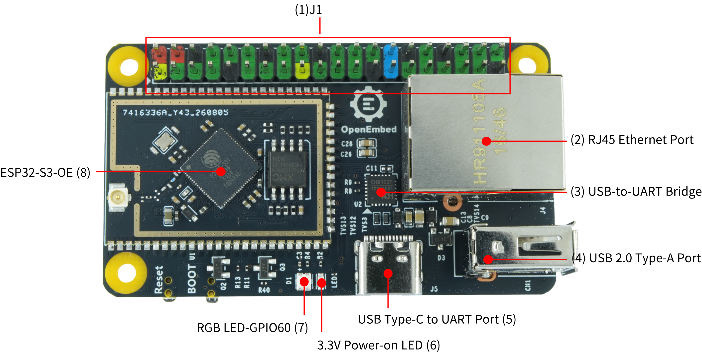
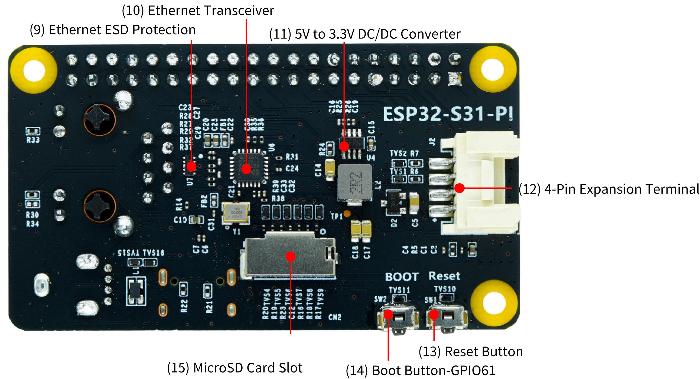
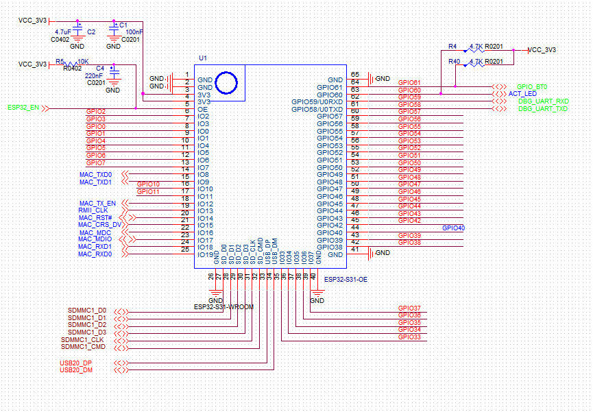

# openembed-esp32s31-pi-examples
The ESP32-S31-PI development board is an open-source board developed by [OpenEmbed][1] based on the ESP32-S31-OE module. It supports Gigabit Ethernet, USB Host, Wi-Fi 6/BLE/Zigbee, and other features. All available pins are broken out to header J1.

## Board Resources

The following images show the complete front and back views of the ESP32-S31-PI development board.

The following introduces the main components on the front and back of the development board in clockwise order.

|Component Number|Main Component|Description|
|---:|:---:|:---|
|1|J1|All available GPIO pins are broken out to header J1 for easy external connection. Compatible with Raspberry Pi GPIO. For details, please refer to Pin Headers.|
|2|RJ45 Ethernet Port|Supports 10/100 Mbps auto-negotiation Ethernet port.|
|3|USB-to-UART Bridge|Onboard single-chip USB-to-UART bridge, working with the USB Type-C to UART Port, is used to power the board, flash firmware, and communicate with the ESP32-S31 chip via serial port.|
|4|USB 2.0 Type-A Port|The USB 2.0 Type-A Port connects to the USB 2.0 OTG High-Speed interface of the ESP32-S31 chip, compliant with the USB 2.0 specification. When communicating with other devices through this port, the ESP32-S31 acts as a USB Host, providing up to 500 mA of current externally.|
|5|USB Type-C to UART Port|Used to power the board, flash applications, and communicate with the ESP32-S31 chip via the onboard USB-to-UART bridge.|
|6|3.3 V Power-on LED|The LED lights up when the board is connected to USB power.|
|7|RGB LED|Addressable WS2812B RGB LED, driven by GPIO60.|
|8|ESP32-S31-OE Module|See [Module Details](#esp32-s31-oe-module-introduction-and-purchase)|

|Component Number|Main Component|Description|
|---:|:---:|:---|
|9|ESD Protection Chip|Used for ESD protection of the Ethernet port to prevent transient high voltage from damaging downstream circuits.|
|10|Ethernet PHY IC|Ethernet PHY chip, connected to the RGMII interface of ESP32-S31 and the RJ45 Ethernet port.|
|11|5 V to 3.3 V DC/DC Converter|Power regulation circuit that converts 5 V input to 3.3 V output.|
|12|Onboard Terminal Block|2.0mm pitch 4-pin female header, used for physical connection and fixation of external power or signals. Compatible with GROVE sensor.|
|13|Reset Button|Press this button to reset the ESP32-S31.|
|14|Boot Button|Download button. Hold down the Boot button while pressing the Reset button to enter 'Firmware Download' mode. Firmware can be downloaded via the UART port or USB serial/JTAG port.|
|15|microSD Card Slot|This development board supports 4-bit mode microSD cards.|

## ESP32-S31-OE Module Introduction and Purchase

Purchase link coming soon. Please stay tuned!

## Hardware Schematic

The following image shows the hardware schematic of the ESP32-S31-PI development board.

## Getting Started

This repository contains example projects for the ESP32-S31-PI development board. You can use it with different development environments.

### Arduino
Navigate to the `arduino` folder and open the `.ino` file in the Arduino IDE.

### ESP-IDF
For detailed instructions on setting up the environment and running ESP-IDF projects, please refer to the **[ESP-IDF Guide](esp-idf/README.md)**. This guide covers:
- Setting up the ESP-IDF environment from the official website.
- Using the ESP-IDF extension in VS Code.
- Opening, compiling, and running projects.
- Configuring project options via `menuconfig`.

### PlatformIO
Open the `platformio` folder in VS Code with the PlatformIO extension installed.

## Board Accessories
The ESP32-S31-PI development board package may include the following optional accessories. The mainboard and accessories are also available for separate purchase, including:

## Start Developing Applications
Before powering on, please inspect the development board for any physical damage.

## Required Hardware
- ESP32-S31-PI development board
- A USB 2.0 cable (Standard Type-A to Type-C)
- A computer (Windows, Linux, or macOS)

> **Note**
>
> Please make sure to use a proper USB cable. Some cables are for charging only and cannot be used for data transfer and programming.

## Hardware Setup

1. Insert the USB cable to connect the PC and the two USB ports on the development board respectively.
2. At this point, the red power LED should light up.

## Software Setup
Please refer to the ESP-IDF [Get Started][2] section to learn how to quickly set up the development environment and flash applications to your development board.

> **Note**
>
> The development board uses the USB port to communicate with the PC. Most operating systems (Windows, Linux, macOS) have the required drivers pre-installed, and the board should be recognized automatically when plugged in. If the device is not recognized or a serial connection cannot be established, please refer to [Establish Serial Connection with ESP32-S31][3] for detailed steps on installing drivers.

---
[1]:https://openembed.com/ "Shenzhen OpenEmbed Measurement and Control Co., Ltd."
[2]:https://docs.espressif.com/projects/esp-idf/en/latest/esp32s31/get-started/index.html "Get Started"
[3]:https://docs.espressif.com/projects/esp-idf/en/latest/esp32s31/get-started/establish-serial-connection.html "Establish Serial Connection with ESP32-S31"