[English](README.md) | [简体中文](README.zh-CN.md)

# ESP-IDF 使用指南

本文档介绍如何在 ESP32-S31-PI 上使用 ESP-IDF 进行开发。


> **快速通道**：
> 如果你已经掌握了 ESP-IDF 的基本配置（环境搭建、新建工程、编译烧录、工程配置等），可以快速略过前面的基础章节，直接跳转到 **[如何使用本仓库示例](#如何使用本仓库示例)**。
> 如果你是新手，推荐按顺序阅读。前面的基础章节将带你完成从环境搭建、新建工程、编译烧录，到分区表配置和 PSRAM 开启的完整流程


## 官方参考安装步骤（非必读）

如需查看官方最新、最详细的安装说明，请访问：[ESP-IDF 快速入门](https://docs.espressif.com/projects/esp-idf/zh_CN/latest/esp32s31/get-started/index.html)

> **说明**：乐鑫官方提供了完整的安装文档，可作为权威参考。本文档后续将提供一套精简的配置步骤，从运行 EIM 开始。


## 准备工作

在正式开始配置之前，请先完成以下三项准备工作：

### 1. 安装 VS Code
请按照官方指引下载并安装 VS Code：[VS Code 官方指南](https://code.visualstudio.com/docs/getstarted/overview)

### 2. 安装 ESP-IDF 扩展
安装 VS Code 后，打开左侧扩展商店，搜索 `idf`，安装 Espressif Systems 提供的 ESP-IDF 扩展。

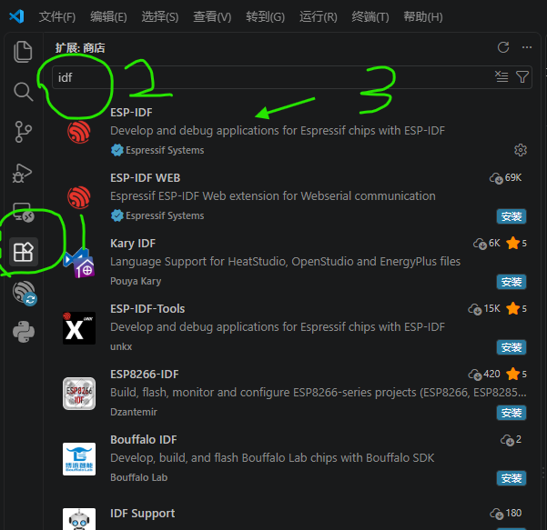

### 3. 下载 EIM 工具
请前往乐鑫官方发布页，下载适合你操作系统的 ESP-IDF Installation Manager（EIM）：
[ESP-IDF Installation Manager](https://dl.espressif.cn/dl/eim/)

> 完成以上准备后，请继续阅读后续章节，我们将从运行 EIM 开始，一步步完成环境配置。


## 安装步骤

1. 双击运行您下载的 EIM 安装程序（例如 `eim-gui-windows-x64.exe`），打开 ESP-IDF Installation Manager 欢迎界面：

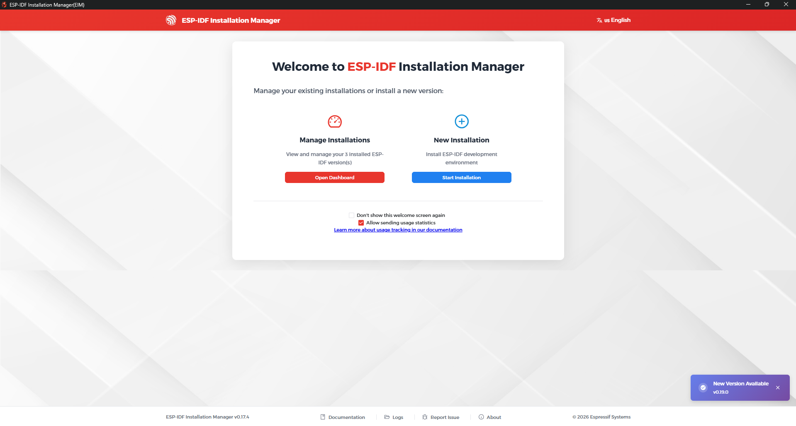

2. 点击 "New Installation" 下的 "Start Installation" 按钮，进入安装选项界面：

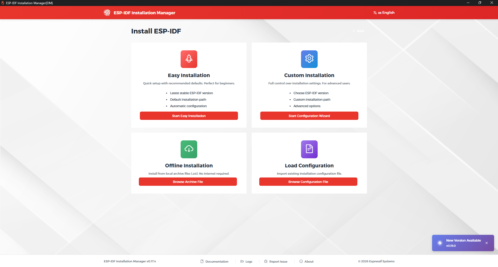

3. 选择 "Easy Installation"，点击红色的 "Start Easy Installation" 按钮。

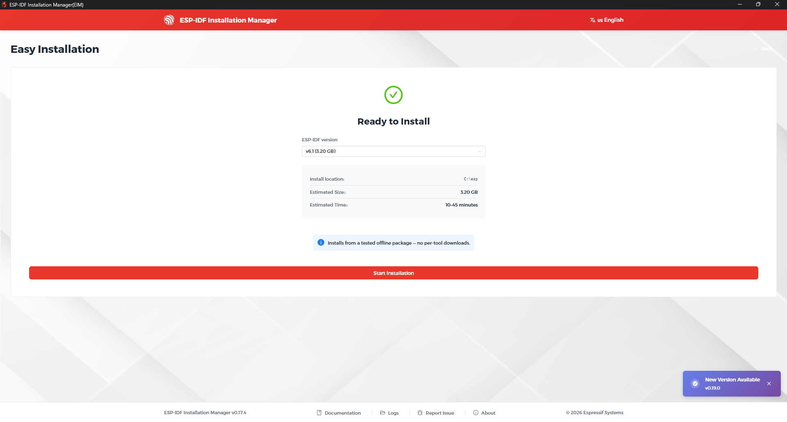

在接下来的界面中，从 "ESP-IDF version" 下拉菜单中选择 `v6.1`（或更高版本）。

> **注意**：ESP32-S31 支持需要 v6.1 或更高版本，请勿选择低于 v6.1 的版本。

然后点击红色的 "Start Installation" 按钮。

4. 根据屏幕提示操作。在此过程中，系统可能会提示您安装或更新 Python 等必要的工具链。

安装完成后，环境即准备就绪。
## 新建示例工程

1. 双击打开 VS Code。在左侧活动栏（最左侧竖条）的最下方找到并点击 **ESP-IDF** 图标（类似芯片或蜘蛛网形状）：

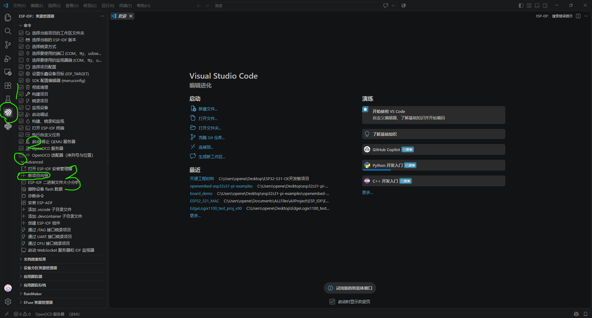

2. 在左侧边栏中，点击展开 `Advanced`（高级），然后点击 `New Project Wizard`（新项目向导）。

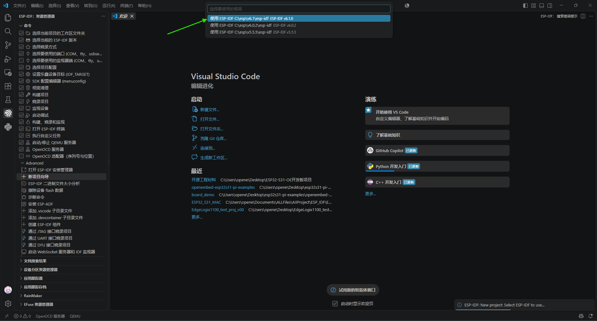

随后，在 VS Code 顶部中间会弹出一个下拉菜单，选择我们之前安装的 `v6.1` 或更高版本的 ESP-IDF（如 `使用 ESP-IDF C:\esp\v6.1\...`）。

3. 在新建项目页面，按以下路径在左侧展开：`ESP-IDF Examples` -> `get-started` -> `hello_world`。选中 `hello_world` 后，点击页面中上方的蓝色按钮 `Create project using template hello_world`：

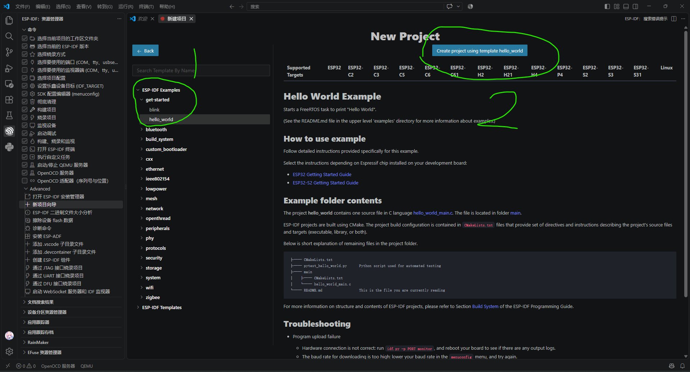

4. 配置项目详情。`Project Name` 保持默认。点击右侧的文件夹图标选择你希望存放项目的路径。在 `Choose ESP-IDF Target` 下拉中选择 `esp32s31`，在 `Choose ESP-IDF Board` 下拉中选择 `ESP32-S31 chip (via builtin USB-JTAG)`：

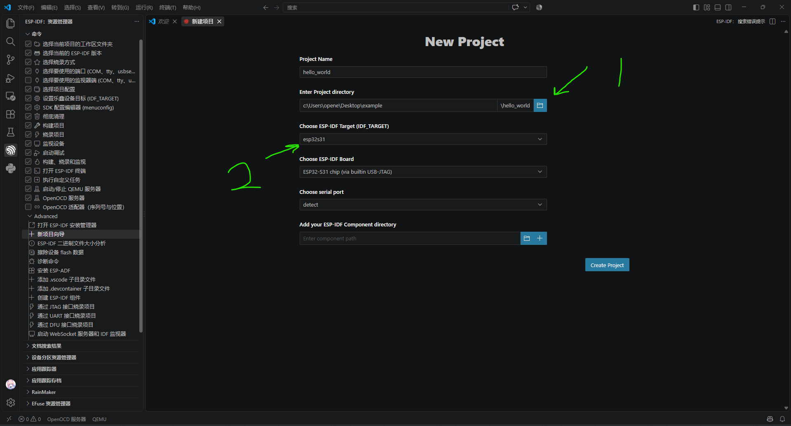

确认无误后，点击页面右下角的蓝色按钮 `Create Project`。

5. 页面提示 `Project has been created!` 即代表创建成功。点击页面中间的蓝色按钮 `Open Project`，即可直接在当前窗口打开该工程：

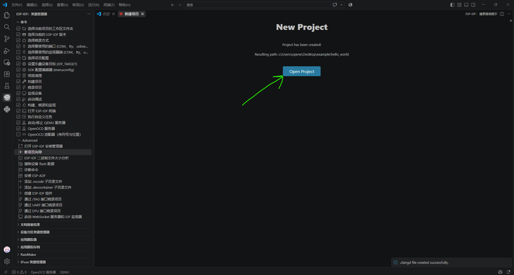

6. 在日常使用中，通常有两种打开项目的方法。第一种是点击 VS Code 顶部菜单栏的 `File` -> `Open Folder...`（打开文件夹）；第二种是直接拖拽项目文件夹到 VS Code 的窗口或图标上。

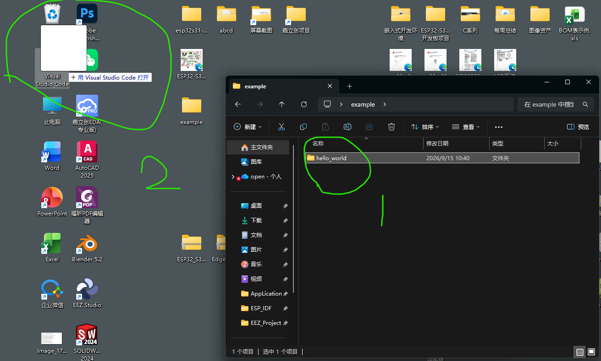

需要注意的是，无论使用哪种方法，你打开的文件夹内部必须**直接包含 `main` 文件夹**（即工程根目录），这样 VS Code 才能将其正常识别为 ESP-IDF 项目。


## 项目设置与准备

1. 打开项目后，页面布局如下图所示。在左侧的“资源管理器”中，点击展开 `main` 文件夹：

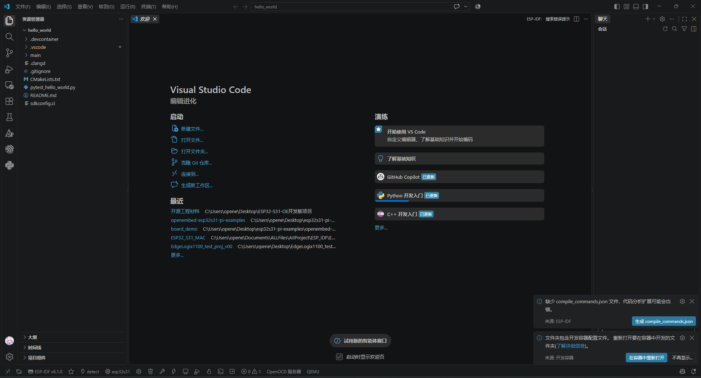

2. 点击 `main` 文件夹下的 `hello_world_main.c`，即可在右侧查看或修改示例程序：

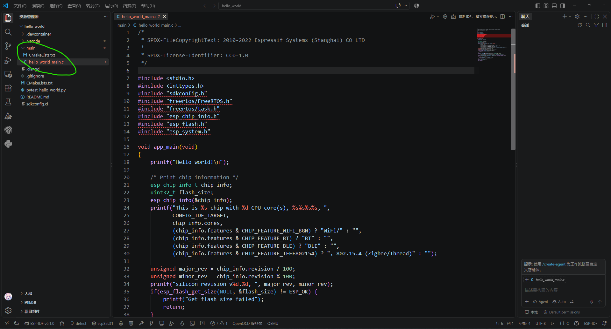

3. 接下来配置烧录方式。在 VS Code 界面左下角的蓝色状态栏中，找到并点击一个星形或火焰形状的图标（取决于你的主题，这里是烧录方式选择按钮）：

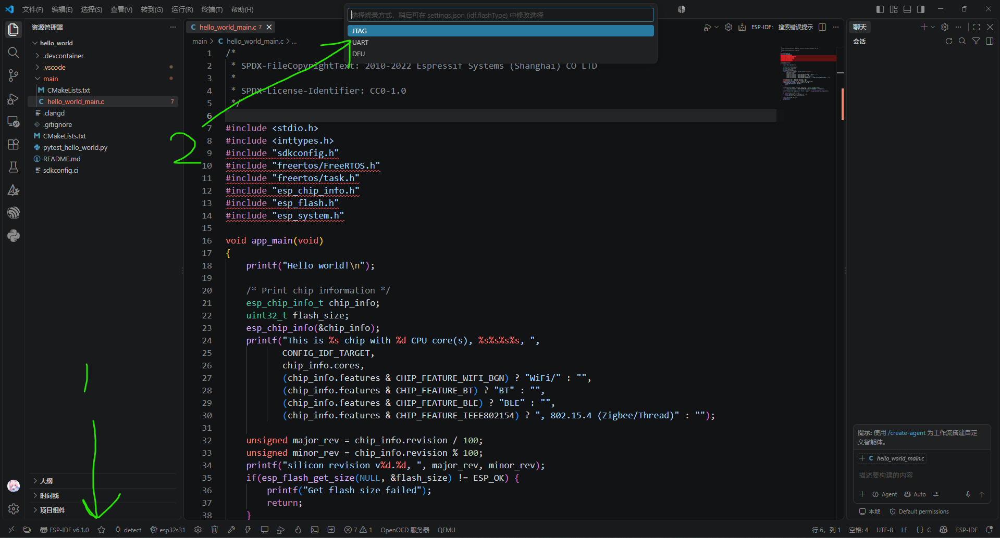

在顶部弹出的下拉菜单中，选择 `UART`。

4. 然后选择串口。在 VS Code 左下角的蓝色状态栏中，点击 `detect` 按钮，它会自动扫描当前电脑已连接的串口设备：

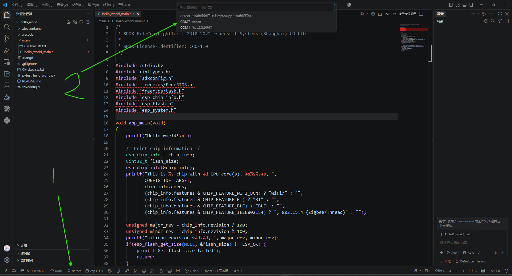

> **注意**：如果这一步无法找到设备，请先安装 CH340 驱动，或者检查开发板连接是否松动、数据线是否支持数据传输。

扫描完成后，在顶部弹出的下拉菜单中，选择你的开发板对应的串口（例如 `COM7`）。至此，项目设置与准备章节完成。下一章节我们将讲述如何编译、烧录与调试。

## 编译、烧录与调试

1. 在 VS Code 底部蓝色的状态栏中，点击左侧第一个“扳手”形状的图标（构建按钮），开始编译项目：

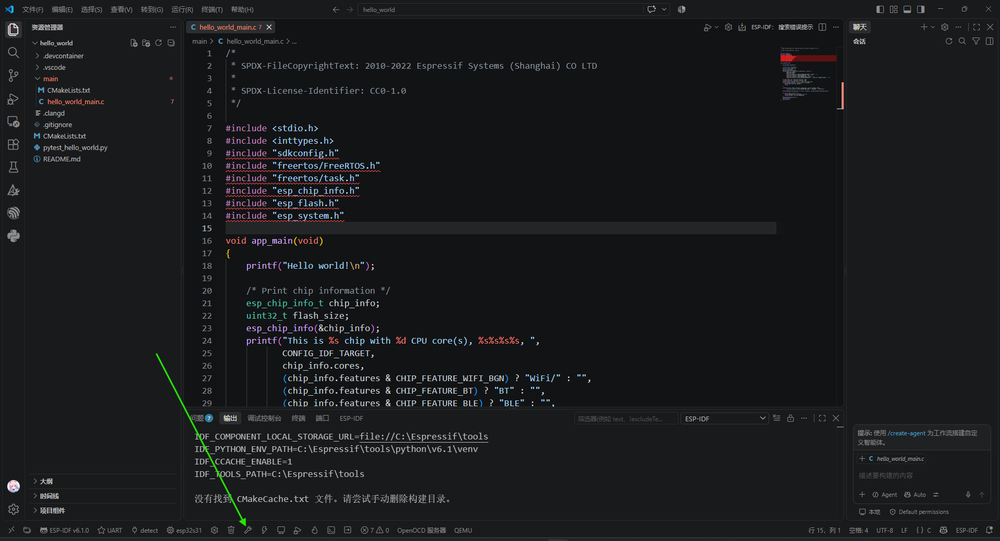

2. 编译过程中，底部的终端窗口会实时输出进度。编译完成后，会输出详细的内存占用信息表（Memory Type Usage Summary）：

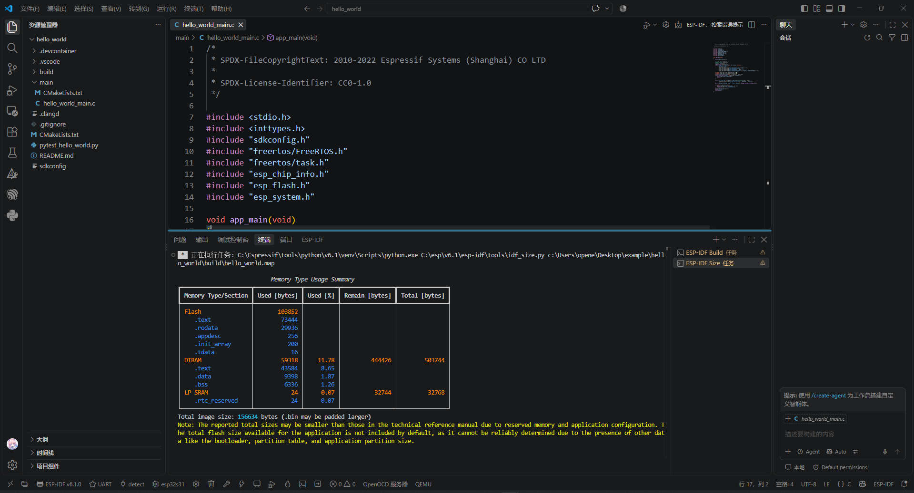

3. 编译成功后，左侧资源管理器中会生成一个新的 `build` 文件夹。里面包含了编译生成的二进制文件、分区表、`sdkconfig.h` 等工程信息。你可以将 build 文件夹中的固件 `.bin` 文件发给其他人，对方使用专门的烧录工具（如 Flash Download Tool）即可直接下载到板子上。同时，`sdkconfig` 文件储存了芯片生成的基本配置（例如 Flash 大小、是否启用 PSRAM 等），下一章节我们将讲述如何使用 `SDK Configuration Editor` 配置这些参数：

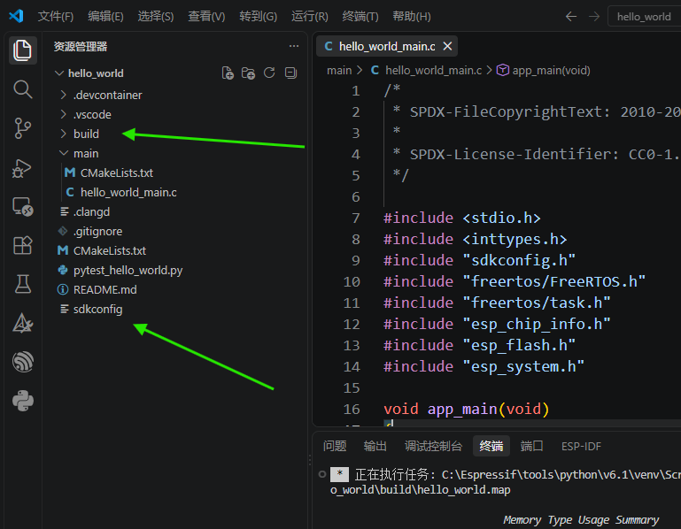

4. 确认编译无误后，点击底部状态栏中“闪电”形状的图标（烧录按钮），即可通过串口下载程序到开发板：

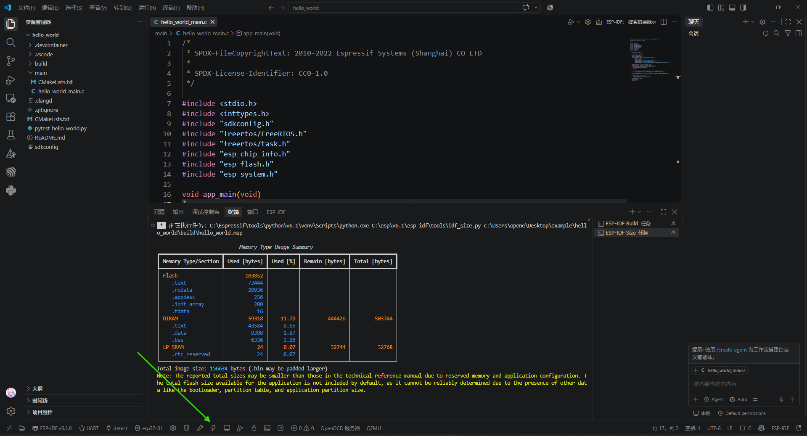

5. 终端会显示连接芯片、擦除、写入、校验等烧录日志。当看到 `Flash has finished.` 时，说明烧录成功：

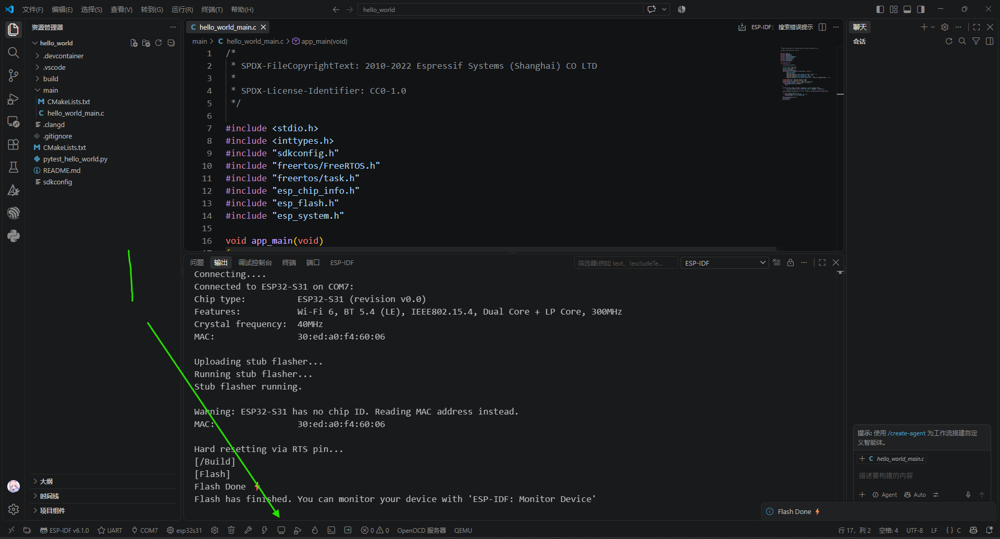

6. 下载完成后，点击底部状态栏右侧的“屏幕/监视器”图标，即可打开串口终端，与开发板建立通信。如果需要退出监视器，请选中终端窗口后，按下 `Ctrl + C` 快捷键：

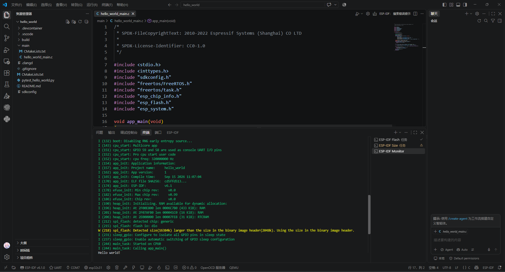


## 项目配置与分区表设置

1. 在 VS Code 左下角的蓝色状态栏中，点击齿轮形状的图标（`SDK Configuration Editor`），打开项目配置菜单：

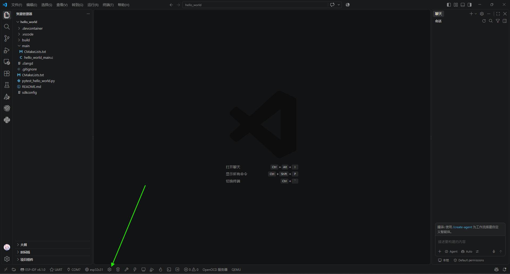

2. 编译一段时间后，会打开 SDK 配置编辑器界面。这个页面顶部有一个搜索框，可以快速搜索并定位选项；右侧是配置项的目录树，可以点击直达需要的配置项：

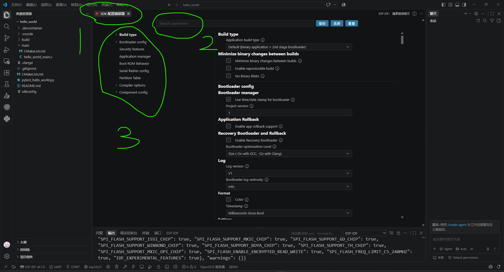

3. 在左侧目录中点击展开 `Boot ROM Behavior`，然后在右侧找到 `Flash size`，在下拉菜单中选择 `16 MB`：

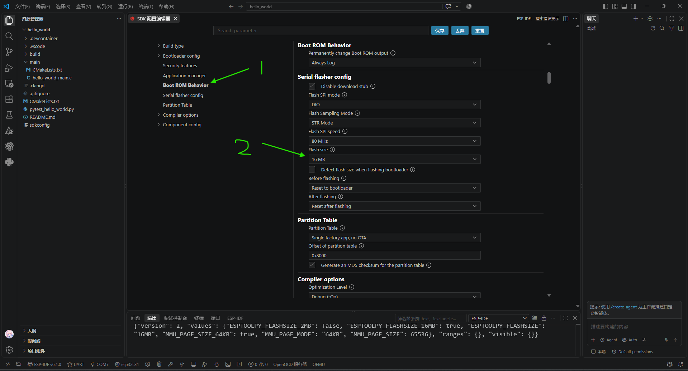

4. 点击左侧目录中的 `Partition Table`。在右侧的 `Partition Table` 下拉菜单中选择 `Custom partition table CSV`（即自定义分区表）：

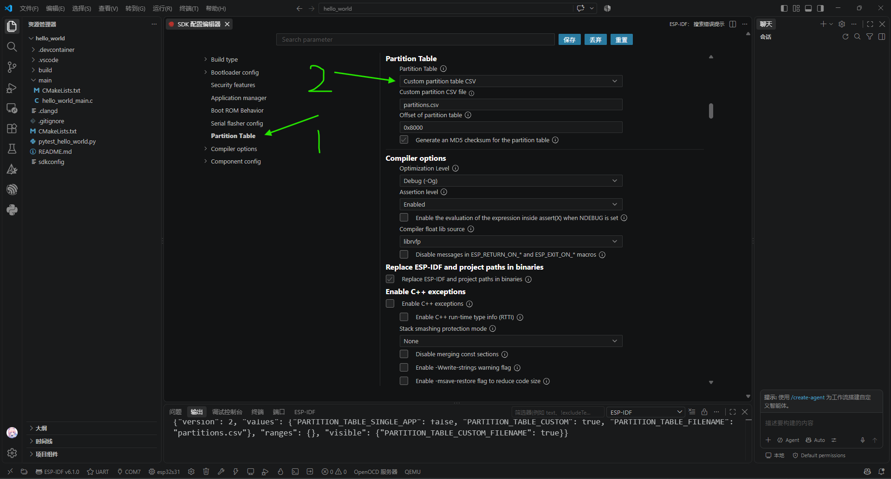

5. 选中 `Custom partition CSV file` 输入框中的默认名字 `partitions.csv`，按 `Ctrl + C` 复制该文件名（你也可以在此时修改为其他名字，这里我们使用默认名字）：

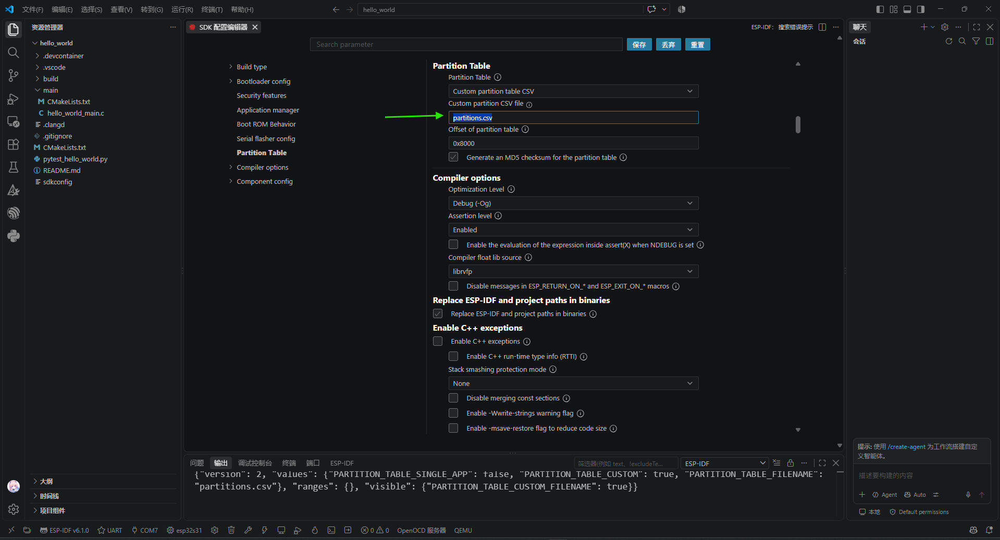

6. 点击资源管理器顶部的“加号”文件图标，在工程根目录新建一个文件。将刚刚复制的 `partitions.csv` 名字粘贴进去并回车创建。然后把下面这段示例分区表代码复制粘贴进去：

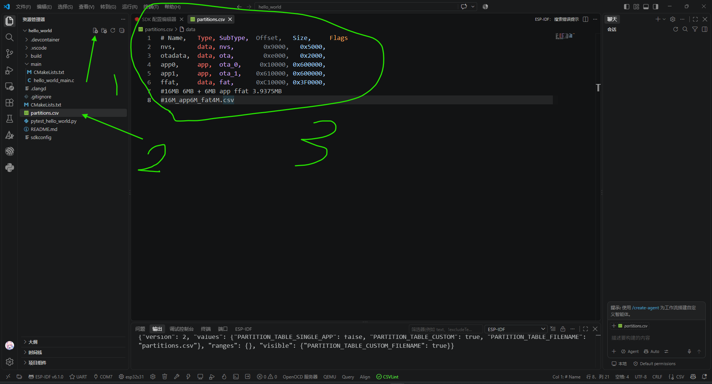

```csv
# Name,   Type, SubType,  Offset,   Size,     Flags
nvs,      data, nvs,        0x9000,   0x5000,
otadata,  data, ota,        0xe000,   0x2000,
app0,     app,  ota_0,     0x10000, 0x600000,
app1,     app,  ota_1,    0x610000, 0x600000,
ffat,     data, fat,      0xC10000, 0x3F0000,
#16MB 6MB + 6MB app ffat 3.9375MB
#16M_app6M_fat4M.csv
```

> **说明**：这张自定义分区表为应用程序划分了较大的空间（各 6MB 的 `app0` 和 `app1` 分区，以及 4MB 的 `ffat` 文件系统分区），非常适合需要存储大量数据或进行 OTA 升级的场景。关于分区表的具体计算和书写规则，可以查看官方文档：[API 指南 - 分区表](https://docs.espressif.com/projects/esp-idf/zh_CN/stable/esp32/api-guides/partition-tables.html)。

编辑完成后，按住 `Ctrl + S` 保存文件。然后点击 SDK 配置编辑器右上角的 `保存` 按钮，关闭配置页面，项目配置即完成。

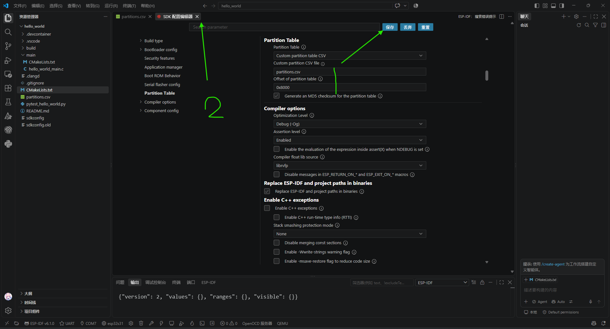

配置完成。下一章节我们将讲述如何配置 PSRAM（外部 RAM）。


## 配置 PSRAM（外部 RAM）

1. 在左侧“资源管理器”中，点击打开项目根目录的 `CMakeLists.txt` 文件：

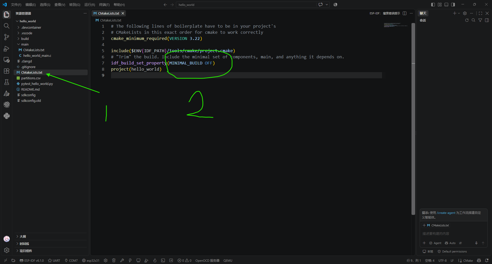

找到第 7 行的 `idf_build_set_property(MINIMAL_BUILD ON)`，将它的参数从 `ON` 修改为 `OFF`。

> **简述**：`MINIMAL_BUILD` 设为 `ON` 时，构建系统只会编译最小依赖集，可能导致部分组件（如 PSRAM）无法正常链接。修改为 `OFF` 可以确保构建系统包含完整的依赖，这是启用 PSRAM 等功能的前提。

2. 修改完成后，按 `Ctrl + S` 保存。再次点击左下角状态栏的“扳手”图标（构建按钮）重新编译项目。等待编译完成。

3. 编译完成后，点击左下角状态栏的“齿轮”图标，再次打开 SDK 配置编辑器。在顶部的 `Search parameter` 搜索框中输入 `ESP PSRAM`：

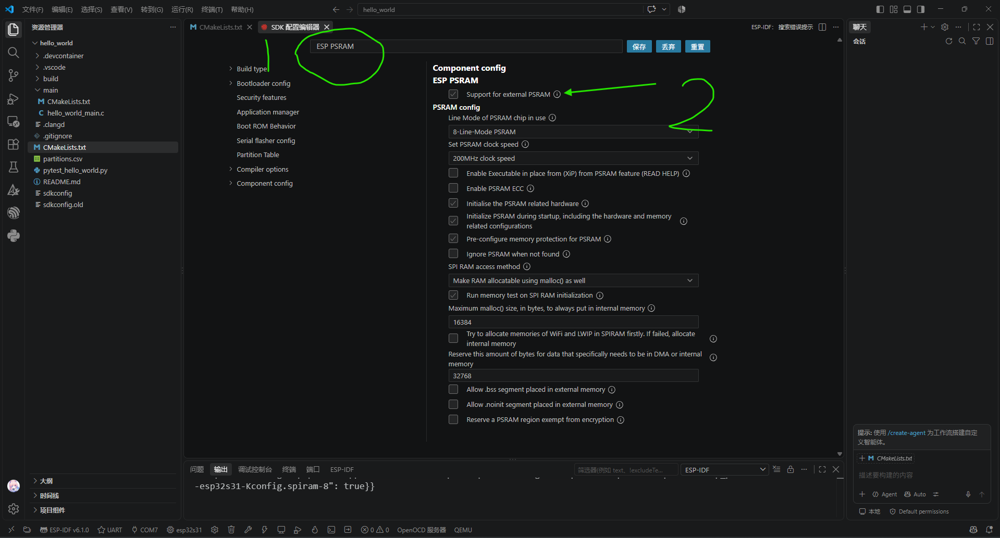

4. 在右侧的 `ESP PSRAM` 配置项中，勾选 `Support for external PSRAM`，然后点击右上角的 `保存` 按钮即可。


## 开启 Debug 依赖（报错信息追踪）

为了让程序在崩溃时能输出更清晰的调试信息，建议开启报错栈的打印功能。

1. 点击左下角状态栏的“齿轮”图标打开 SDK 配置编辑器，在顶部的 `Search parameter` 搜索框中输入 `Panic handler behaviour`：

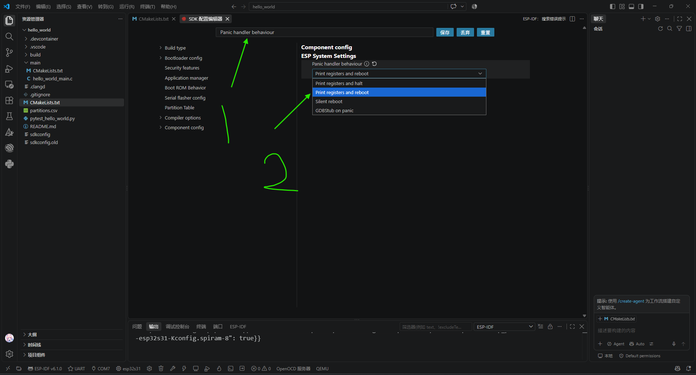

2. 在右侧 `ESP System Settings` -> `Panic handler behaviour` 下拉菜单中，选择 `Print registers and reboot`。

> **说明**：这个选项的作用是，当程序发生严重错误（Panic）导致崩溃时，系统会自动打印出 CPU 的寄存器状态和出错时的调用栈信息，帮助开发者快速定位问题所在。如果希望报错后不重启以便调试，也可以选择 `Print registers and halt` 选项。

3. 选择后，点击右上角的 `保存` 按钮，即可开启详细的报错追踪功能。当程序运行发生异常崩溃时，串口终端就会输出详细的错误定位信息了。  

至此，基础的开发环境配置就完成了。接下来介绍本仓库提供的具体示例。

## 如何使用本仓库示例

本仓库提供了两部分示例：一个完整的综合演示 Demo（位于 `demo` 文件夹），以及基于官方示例、经过少量配置文件（默认引脚和参数）修改以直接适配本开发板的可运行示例（位于 `examples` 文件夹）。

### 综合 Demo 示例

本示例完整展示了开发板的绝大部分外设功能，包括 LCD RGB 显示屏 + LVGL 9.5 + GT911 触摸、RGB WS2812 灯珠、以太网、SD 卡、U 盘挂载，以及 USB 2.0 外设可插拔座子的综合演示。你可以点击 **[Demo 说明文档](demo/board_demo/README.md)** 查看详细的工程介绍与使用说明。

### 其他基础示例

`examples` 文件夹内是经过修改适配的基础示例。它们可以直接按照标准项目打开、编译和调试，包含部分最基础的常用功能（如 `get-started`、`peripherals` 等）。

如果你需要更多官方示例，可以使用新建项目向导。点击左侧边栏的 ESP-IDF 图标，展开 `Advanced`，点击 `New Project Wizard`（新项目向导），即可看到绝大多数 ESP32 官方提供的示例模板：

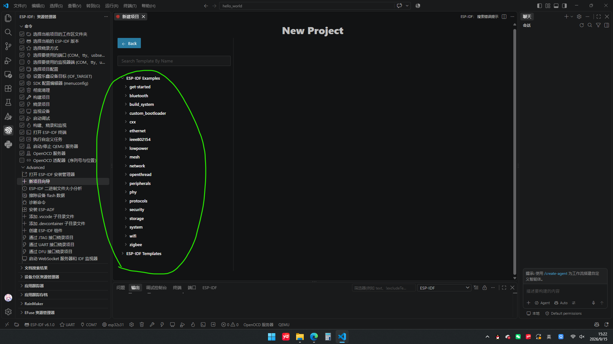